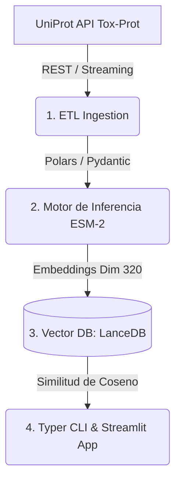

<div align="center">

# 🐍 VenomSearch-AI

**Búsqueda Vectorial Inteligente de Neurotoxinas con ESM-2 (Meta)**

[](https://www.python.org/downloads/release/python-3110/)
[](https://venomsearch-ai.streamlit.app/)
[](https://opensource.org/licenses/MIT)

*Un pipeline de Bioinformática & Ingeniería de Datos de IA. Ingiere datos de la API de UniProt, procesa secuencias no estructuradas, genera embeddings con modelos de lenguaje de proteínas (ESM-2) y provee un dashboard interactivo de Streamlit con visualización 3D y búsqueda de similitud estructural.*

### 🌐 [**¡Probá la Aplicación Web en Vivo!**](https://venomsearch-ai.streamlit.app/)

</div>

---

## 🧬 ¿Cómo funciona?

A diferencia de algoritmos clásicos como BLAST que buscan similitud lineal de secuencias, **VenomSearch-AI "entiende" la biología**. 

Utiliza **ESM-2**, un LLM entrenado por Meta sobre millones de secuencias de proteínas, para generar vectores matemáticos (embeddings) que capturan características complejas como:
- Posibles dominios funcionales
- Puentes disulfuro y estructuras secundarias
- Motivos conservados de toxicidad

El pipeline toma las secuencias curadas (Tox-Prot), calcula sus embeddings en el espacio latente y los indexa en **LanceDB** para realizar búsquedas por **similitud de cosenos en milisegundos**.

---

## 🔬 Ejemplos de Secuencias para Probar

Ingresá cualquiera de estas secuencias en el [Dashboard Web](https://venomsearch-ai.streamlit.app/) para observar las toxinas más similares en la base de datos y visualizar su estructura 3D:

1. **Melitina (Veneno de Abeja)** - *Cardiotoxina / Antimicrobiano*
   ```text
   GIGAVLKVLTTGLPALISWIKRKRQQ
   ```

2. **Cobratoxina (Veneno de Naja kaouthia)** - *Neurotoxina (Bloquea receptores nicotínicos)*
   ```text
   IRCFITPDITSKDCPNGHVCYTKTWCDAFCSIRGKRVDLGCAATCPTVKTGVDIQCCSTDNCNPFPTWK
   ```

3. **Conotoxina (Caracol Conus)** - *Ion channel toxin (Bloquea canales de calcio)*
   ```text
   CKSPGSSCSPTSYNCRQSNCYITPTK
   ```

---

## 📊 Arquitectura del Pipeline

El proyecto está diseñado como un ETL escalable:



## 💻 Tech Stack

| Componente | Tecnología | Propósito |
|:------|:-----------|:--------|
| **App / Visualización** | Streamlit + Plotly + Molstar | UI interactiva, gráficos PCA/UMAP, render 3D |
| **Inferencia pLLM** | ESM-2 (8M params) | Embeddings biológicos |
| **Vector Database** | LanceDB | Indexación y búsqueda de similitud ultrarrápida |
| **Data Processing** | Polars | ETL de alto rendimiento y bajo uso de RAM |
| **Validación** | Pydantic v2 | Tipado estricto para respuestas de APIs |
| **CLI** | Typer + Rich | Interfaz de terminal elegante para correr el pipeline |

---

## 🚀 Correr de Manera Local

Si querés descargar la base de datos y correr el modelo de IA en tu propia computadora:

### 1. Requisitos
- Python 3.11+
- [uv](https://docs.astral.sh/uv/) (Package manager rápido)

### 2. Instalación
```bash
git clone https://github.com/Franco-Arce/venomsearch-ai.git
cd venomsearch-ai
uv sync
```

### 3. Pipeline ETL y CLI
El CLI de `venomsearch` te permite bajar los datos y armar tu propia Vector DB:

```bash
# Bajar proteínas, generar vectores e indexarlos en LanceDB
uv run python -m venomsearch.cli ingest
uv run python -m venomsearch.cli embed
uv run python -m venomsearch.cli index

# Búsqueda desde consola
uv run python -m venomsearch.cli search "GIGAVLKVLTTGLPALISWIKRKRQQ"
```

### 4. Lanzar la App Web
```bash
uv run streamlit run src/venomsearch/app.py
```

---

## 📚 Origen de los Datos
Todos los datos provienen de **UniProt Tox-Prot** (The Universal Protein Resource). Se extraen programáticamente mediante su API REST (utilizando paginación cursor-based). Solamente se admiten entradas **revisadas (Swiss-Prot)** para garantizar la mayor precisión biológica.

## 📄 Licencia
Este proyecto fue creado por Franco Arce como demostración de portfolio. Licencia MIT.
